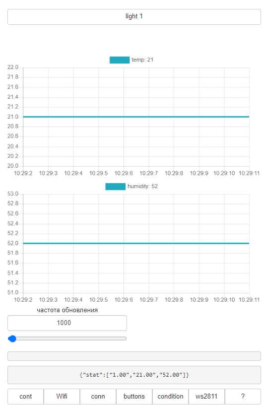
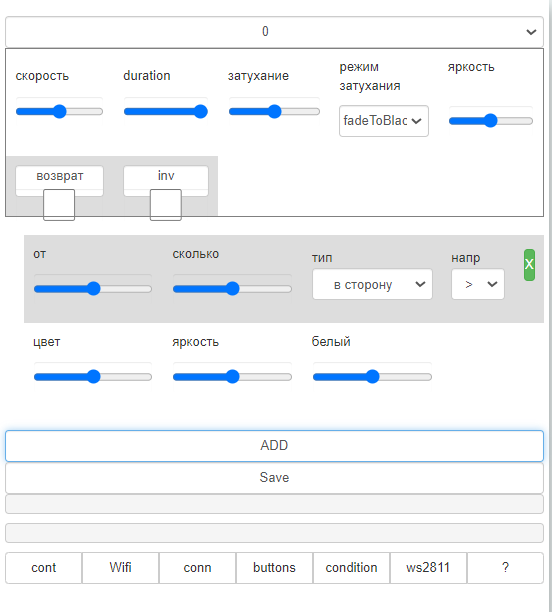
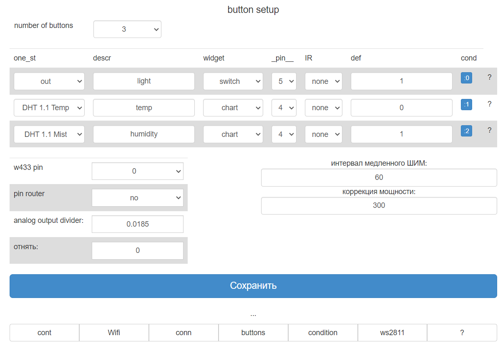
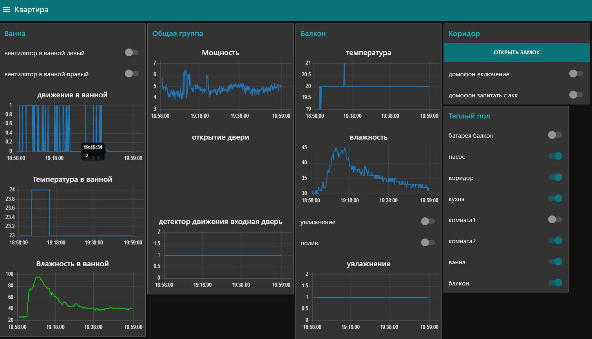
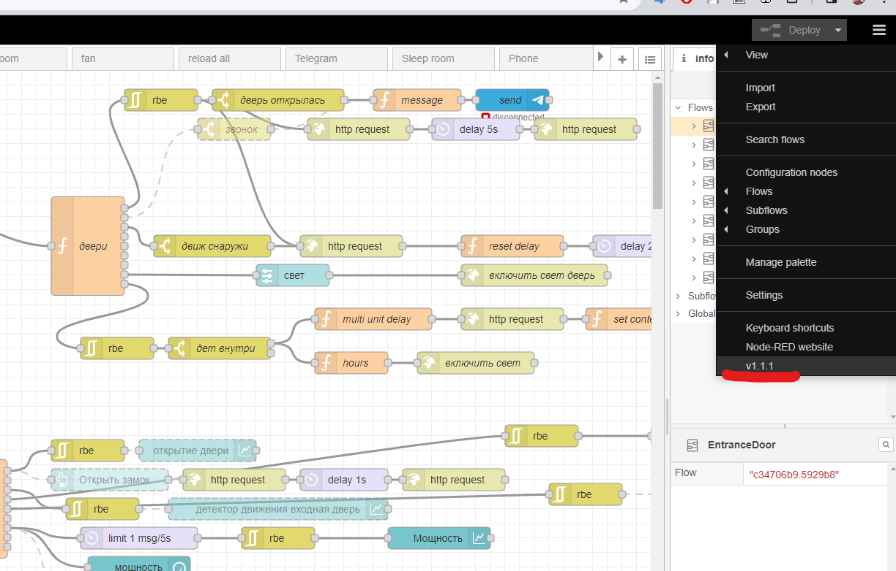
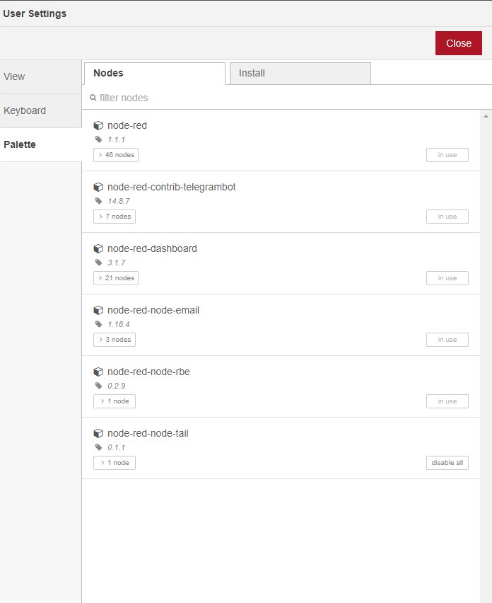

## Описание

в квартире есть устройства с вай-фай приемником

что бы они автоматически подтянулись, должен быть wifi

с названием точки доступа `Home`
пароль `sp5506487sp`


## устройства

двери - [192.168.1.110](http://192.168.1.110)

теплый пол [192.168.1.111](192.168.1.111)

ванна [192.168.1.112](192.168.1.112)

спальня [192.168.1.116](192.168.1.116)

если не знаете адрес, зайдите на по адресу на роутер [192.168.1.1](http://192.168.1.1) и в списке подключенных устройств найдите все esp устройства


можно зайти на них. и увидеть все что подключено сейчас
---

на каждом устройстве есть страница с `help` где можно прочитать как подключить устройства по API
страница `Home` устройств это главная страница, там отображаются все переключатли


---

страница `ws8211` это страница где вы можете переключать подстветку


---

страница `buttons` где настраиваются выводы (если вы не пытаетесь перенастроить устройство, не трогайте эту страницу)




## умный дом - Node-red

вы можете подключить [NodeRed](https://nodered.org/) к вашим устройствам (или любой другой умный дом, но я делал с NodeRed)
NodeRed можно установить на Windows, linux, raspberry Или телефон с андроидом выше 5.0




установка на телефон:

[node-red phone Android](https://nodered.org/docs/getting-started/android)

важно! 

нужно установить node-red версии v1.1.1 

как это сделать:

```
apt update
apt upgrade
apt install coreutils nano nodejs
npm i -g --unsafe-perm node-red v1.1.1
node-red
```

затем нужно перейти на адрес вашего node-red, порт 1880 тоесть: http://192.168.1.141:1880/ (я не знаю какой будет адрес у вашего устройства с node-red)

нужно будет поставить все необходимые расширения в node-red: (три полоски справа вверху - Manage pallete - вкладка install)

импортируйте этот файл: [flows](flows.json)




установка завершена

вы можете пользоваться node-red если перейдете по адресу http://<node-red>:1880/ui

